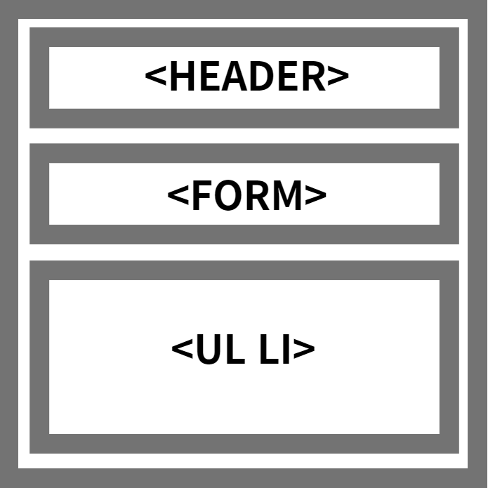

# 🍰 케이크 프로젝트

- 시스템 아키텍처
  
- js,html,css
- 기획 의도 → 쇼핑몰 자동화? 아무튼 케이크와 디저트를 주제로 필터를 거쳐서 카테고리별 여과 기능과 검색창에 부합하는 이름만 나오게끔 하는 요소를 연습하고자 만들었음

---

### 결과물

.png>)
기본 INDEX

---

.png>)
버튼 클릭시 여과부분

---

```HTML
  <div class="wrap">
      <div class="inner">
        <div class="main-content">
          <h1>Cake OpenRun</h1>
          <form>
            <input class="filter" type="text" placeholder="Search" /><i
              class="fas fa-search search-icon"
            ></i>
          </form>
```

```JAVASCRIPT
const cakeArr = [
  {
    name: "Strawberry cake",
    price: "5$",
    img: "이미지링크",
    category: "cakes",
    detail_img:
      "이미지링크",
    detail_name: "쿠키앤 크림",
    detail_desc:
      "프리미엄 디저트 카페 투썸플레이스는 국산 쌀로 만든 고소한 우리 미(米) 무스 등 케이크 2종을 새롭게 출시한다고 28일 밝혔다. 국산 쌀로 만든 고소한 우리 미(米) 무스 케이크는 최근 MZ세대 사이에서 각광받고 있는 로(Low) 푸드 트렌드를 접목한 글루텐 프리 제품이다. 고소하고 담백한 쌀과 우유 플레이버 조합으로 은은한 달콤함을 살렸다.",
  },
  {
    name: "Strawberry Cream Cake",
    price: "10$",
    img: "이미지링크",
    category: "cakes",
    detail_img:
      "이미지링크",
    detail_name: "생크림 우유 딸기 케이크",
    detail_desc:
      "트로베리 시즌 대표 케이크로 선보이는 딸기 우유 생크림(홀/피스)은 순백의 시트 사이사이 순 우유, 딸기우유 무스와 생크림을 가득 채우고 생딸기를 올린 제품이다. 시트에 난백란을 사용해 눈처럼 새하얀 비주얼이 특징이다. 딸기와 맛 페어링이 가장 좋은 순 우유를 활용, 딸기 제철 시기에 가장 맛있게 케이크를 즐기는 방법으로 제안하는 제품이다.",
  },
const cakeList = document.querySelector(".cake-list");
const cakeListli = document.querySelector(".cake-list li");
const filterInput = document.querySelector(".filter");
const btnSelect = document.querySelectorAll(".btn-form button");

const detailWrap = document.querySelector(".detail-wrap");
const dim = document.querySelector(".dim");
const btnClose = document.querySelector(".btn-close");
const detailList = document.querySelector(".detail-list");


```
